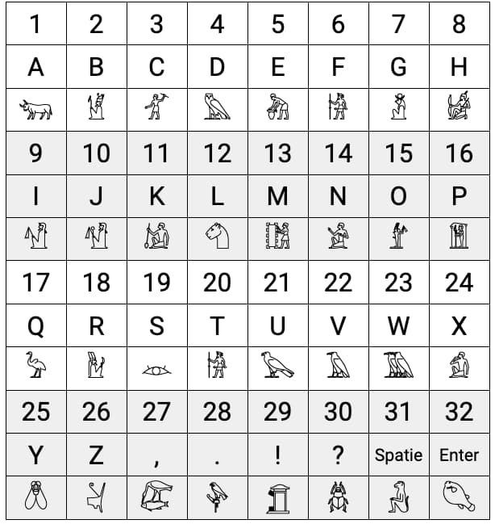

# SpyNetwork
A simple encrypted spy message website and Android app thing made for a Scouting camp 2022

## Encryption system
This tool uses a very simple encryption system, every character in the input is encoded hyroglyph. Every hyroglyph also has a number. The first hyroglyph of the output string is a number where all characters are shifted by. So you need to subtract that number from every hyroglyph to get the right character back. Here is the hyroglyph table:

